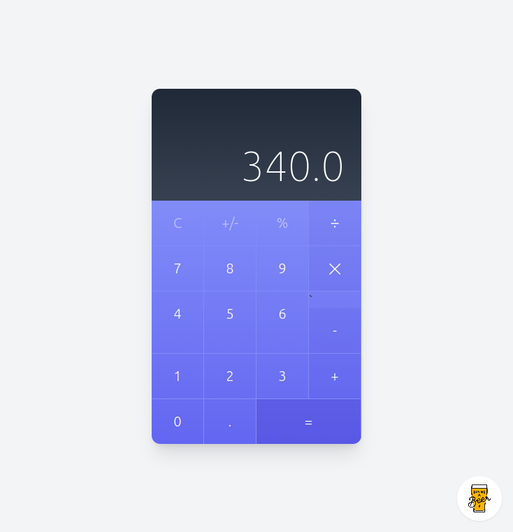

  

  <h3 align="center">Calculadora en Angular</h3>

  

    Un asombroso diseño funcional de un clásico proyecto de calculadora.
     
  

## Acerca del proyecto

  

Creación de una estructura HTML hecha en Tailwind, mostrando soluciones a problemas estructurales al recrear el diseño en componentes de [Angular](https://angular.dev/). Créditos a [Klerith](https://www.creative-tim.com/twcomponents/component/calculator-ui-2) por el tema utilizado en el proyecto.

### Temas de aprendizajes:
* Tailwind
* Zoneless
* OnPush
* ViewEncapsulation
* ng-deep (Deprecared)
* Content Projection
* input Signals
* Standalone components
* Angular Schematics
* Host bindings

El diseño seleccionado, que se ha hecho funcional, requiere un nivel de complejidad real para aprender a utilizar estructuras modernas de Angular.

### Desarrollado con
En la elaboración de este proyecto se utilizaron las siguientes tecnologías:

  
   

 

## Instalación del proyecto

### Servidor de desarrollo

Ejecuta `ng serve` para iniciar un servidor de desarrollo. Navega a `http://localhost:4200/`. La aplicación se recargará automáticamente si cambias alguno de los archivos fuente.

### Generación de código

Ejecuta `ng generate component nombre-del-componente` para generar un nuevo componente. También puedes usar `ng generate directive|pipe|service|class|guard|interface|enum|module`.

### Compilación

Ejecuta `ng build` para compilar el proyecto. Los artefactos de la compilación se almacenarán en el directorio `dist/`.
